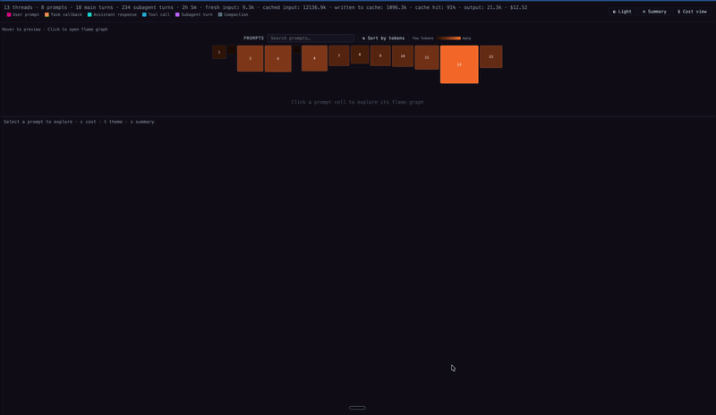

# Token Lens

[](https://github.com/Brickell-Research/token-lens/actions/workflows/ci.yml)
[](https://opensource.org/licenses/MIT)
[](https://github.com/Brickell-Research/token-lens/releases/latest)
[](https://github.com/Brickell-Research/token-lens/releases)
[](https://bun.sh)
[](https://www.typescriptlang.org)

Flame graphs for [Claude Code](https://claude.ai/code) token usage, grounded in a per-prompt heatmap colored by token count or estimated cost.



## Install

```sh
brew tap Brickell-Research/caffeine
brew install token-lens
```

## Usage

Render your most recent Claude Code session:

```sh
token-lens render
open flame.html
```

Record a bounded window while you work:

```sh
token-lens record --duration-in-seconds=300
# ... do your Claude Code work ...
token-lens render
open flame.html
```

### Options

```sh
token-lens record --output=my-session.json         # save to a specific path
token-lens render --file-path=my-session.json      # render a specific capture
token-lens render --output=report.html             # write HTML to a custom path
```

## License

[MIT](./LICENSE)
